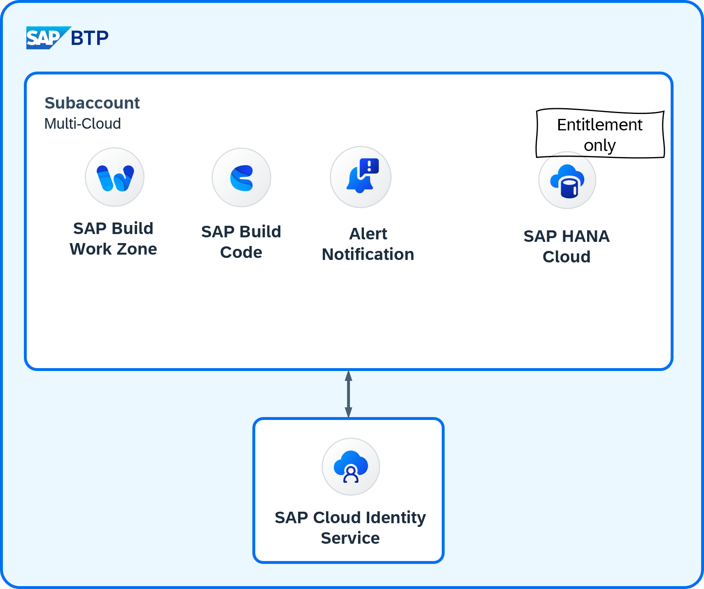

# Template for development (basis setup)

This template comprises the setup of resources on SAP BTP (basis setup).

## Resource overview

## Basic building blocks

The basic setup comprises the following resources:

- An SAP BTP subaccount following the corporate naming convention and labeling guidelines
- Assignment of emergency administrators

## Contained services and applications

| Resource name | Technical Name | Plan |  Quota | Entitled only
| --- | --- | --- | --- | ---
| Alert Notification Service | `alert-notification` | `standard` | - | no
| SAP Build Workzone Standard Edition | `SAPLaunchpad` | `standard` | - | yes
| SAP Business Application Studio | `sapappstudio` | `standard-edition` | - | no
| SAP HANA Cloud | `hana-cloud` | `hana` | - | yes
| SAP HANA Schemas & HDI Containers |`hana` | `hdi-shared` | - | yes
